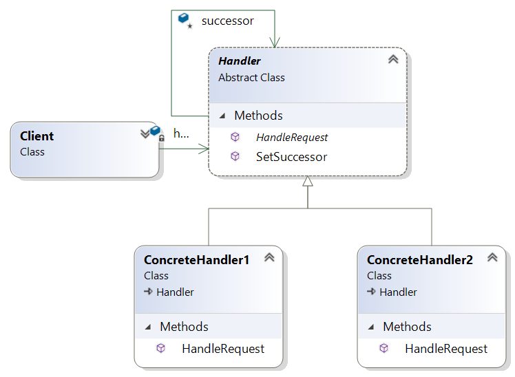
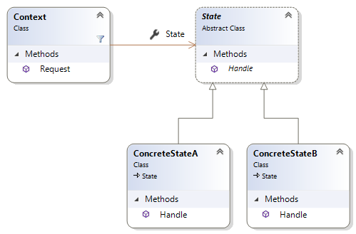
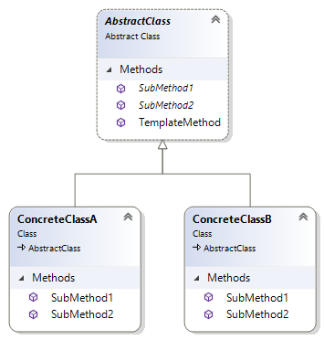

# DesignPatternInCSharp
Design Pattern In C#:
## 1 Behavioral (Wzorce zachowania)
Zajmują się komunikacją pomiędzy obiektami. Głównie występują w algorytmach i w skomplikowanych systemach odpowiedzialności pomiędzy obiektami.
* Chain of Responsibility
* Command
* Interpreter
* Iterator
* Mediator
* Memento
* Observer
* State
* Strategy
* Template Method
* Visitor
## Wzorzec ma na celu:
* Chain of Responsibility

Umożliwiać przekazywanie żądania na coraz wyższe poziomy aż do znalezienia obiektu, który je obsłuży
* Command

Hermetyzacja wywołania metody w obiekcie
* Interpreter

Dystrybuować operacje w taki sposób, że każda implementacja odnosi się do innego typu kompozycji
* Iterator

Udostępniać sekwencyjnego sposobu dostępu do elementów kolekcji
* Mediator

Skupić odpowiedzialność w jednej klasie, nadzorującej interakcję innych obiektów
* Memento

Zrekonstruować obiekt na podstawie starszej jego wersji, zawierającej wyłącznie stan wewnętrzny
* Observer

Oddzielić obiekt od znajomości obiektów od niego zależnych
* State

Dystrybuować operacje w taki sposób, że każda klasa reprezentuje różny stan
* Strategy

Hermetyzować operacje, powodując stworzenie zmiennych implementacji
* Template Method

Zaimplementować (w postaci metody) kilka kroków wykonania algorytmu, aby klasy podrzędne mogły je ponownie zdefiniować.
* Visitor

Umożliwienie zdefiniowanie nowej operacji dla hierarchii bez konieczności zmiany klas zawartych w tej hierarchi
## Wzorce zachowania można podzielić na grupy:
### Wzorce operacji
* Command
* Interpreter
* State
* Strategy
* Template Method
### Wzorce rozszerzeń
* Iterator
* Visitor
### Wzorce odpowiedzialności
* Chain of Responsibility
* Mediator
* Observer
### Wzorce konstrukcyjne
* Memento
## Diagramy:
<b>Chain of Responsibility:</b>
 
 
<b>Command:</b>
 
 
<b>Interpreter:</b>
 
 
<b>Iterator:</b>
 
 
<b>Mediator:</b>
 
 
<b>Memento:</b>
 
 
<b>Observer:</b>
 
 
<b>State:</b>
 
 
<b>Strategy:</b>
 
 
<b>Template Method:</b>
 
 
<b>Visitor:</b>
 
 

## 2 Structural (Wzorce strukturalne)
Zajmują się związkami pomiędzy obiektami i tym jaka powinna być interakcja między nimi. Wszystko w celu ułożenia złożonego obiektu.
* Adapter
* Bridge
* Composite
* Decorator
* Facade
* Flyweight
* Proxy
## Wzorzec ma na celu:
* Adapter

Zadaptować istniejący interfejs klasy do postaci oczekiwanej przez klienta	
* Bridge

Oddzielić operacje abstrakcyjne od ich implementacji w celu wprowadzania w nich niezależnych zmian.
* Composite

Zdefiniować interfejs uwzględniający zarówno pojedyńcze obiekty, jak i grupy obiektów
* Decorator

Umożliwienie programistom dynamicznego tworzenia zachowania
* Facade

Stworzyć prosty interfejs dla zestawu klas
* Flyweight

Skupić odpowiedzialność w drobnych, współużytkowanych obiektach
* Proxy

Pozwolić obiektowi działać w imieniu innego obiektu
## Wzorce strukturalne można podzielić na grupy:
### Wzorce odpowiedzialności
* Proxy
* Flyweight
### Wzorce interfejsów
* Adapter
* Bridge
* Composite
* Facade
### Wzorce rozszerzeń
* Decorator

## Diagramy:
<b>Adapter:</b>
 
 
<b>Bridge:</b>
 
 
<b>Composite:</b>
 
 
<b>Decorator:</b>
 
 
<b>Facade:</b>
 
 
<b>Flyweight:</b>
 
 
<b>Proxy:</b>
 
 
